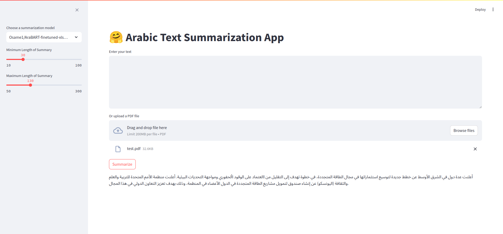

# arabic-text-summarization

This Streamlit application utilizes a fine-tuned version of a set of summarization models specifically designed for Arabic text. The models are fine-tuned on the [XL-Sum dataset](https://huggingface.co/datasets/csebuetnlp/xlsum). Users can either input text directly or upload a PDF for summarization.

## Screenshots


## Getting Started
### Local Setup
1. Clone the Repository: Begin by cloning this repository to your local machine.
```bash
git clone git@github.com:same-ou/arabic-text-summarization.git
```
2. Install Dependencies: Navigate to the project directory and install the required dependencies.
```bash
cd arabic-text-summarization
pip install -r requirements.txt
```
3. Run the application:
```bash
streamlit run app.py
```
After starting the app, navigate to http://localhost:8501 in your web browser to use the application.

### Docker Setup
1. Build the Docker Image
```bash
docker build -t streamlit-app .
```
2. Run the Docker Container
```bash
docker run -p 8501:8501 streamlit-app
```
Access the application by navigating to http://localhost:8501 in your web browser.

## Connect With Me
Have feedback, suggestions, or questions about the Whisper speech recognition deployment? Feel free to connect with me:

Email: [elhadramidev@gmail.com](mailto:elhadramidev@gmail.com)       |       Linkedin: [OUSSAMA EL HADRAMI](https://www.linkedin.com/in/elhadrami-oussama/)

Happy coding! 🚀✨

[slides](https://docs.google.com/presentation/d/18zmaqAn3_0ygYXY1gytLW0PxJB4MG7dxebzekoC6QHM/edit#slide=id.p)     | [app](https://arabicsumm.streamlit.app/)


